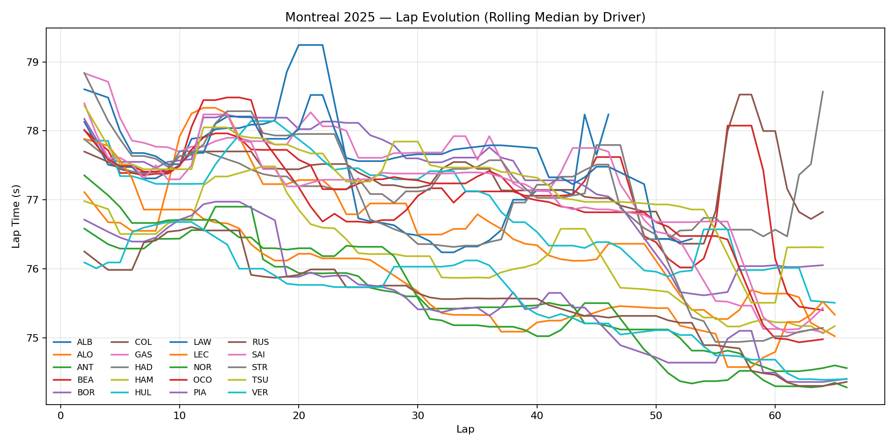
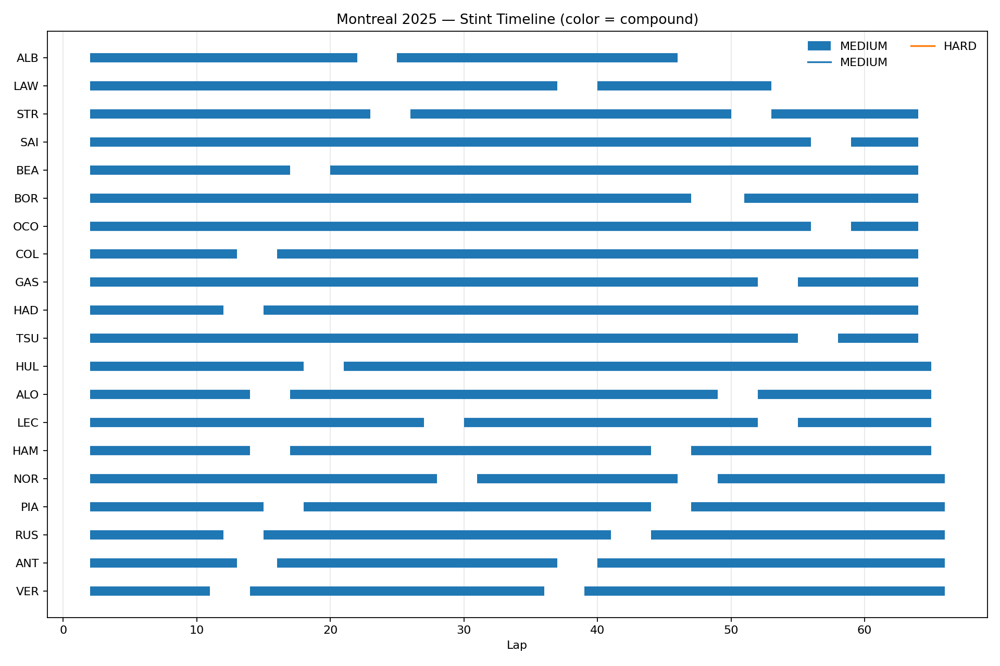
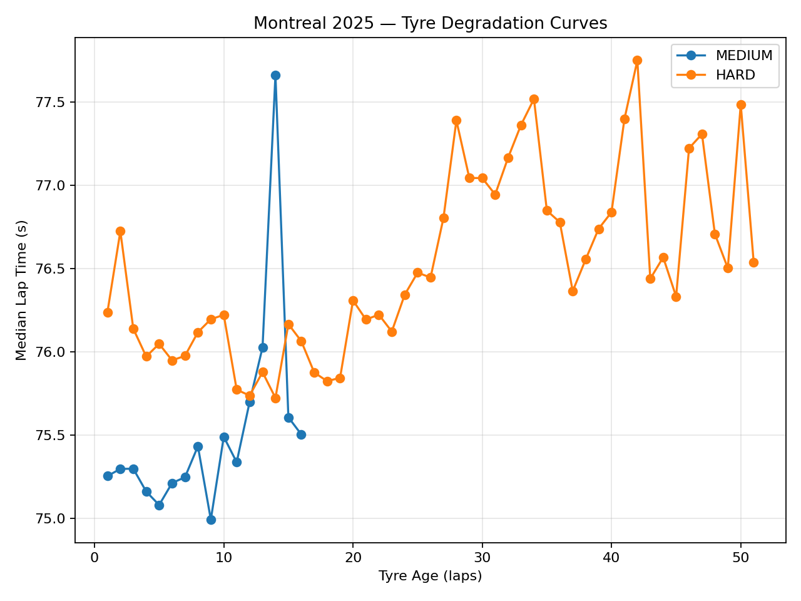
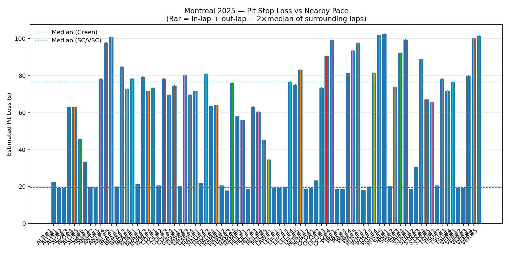
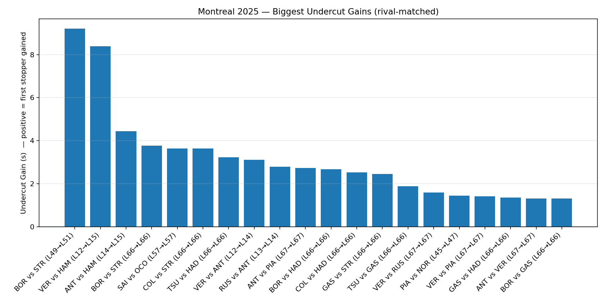
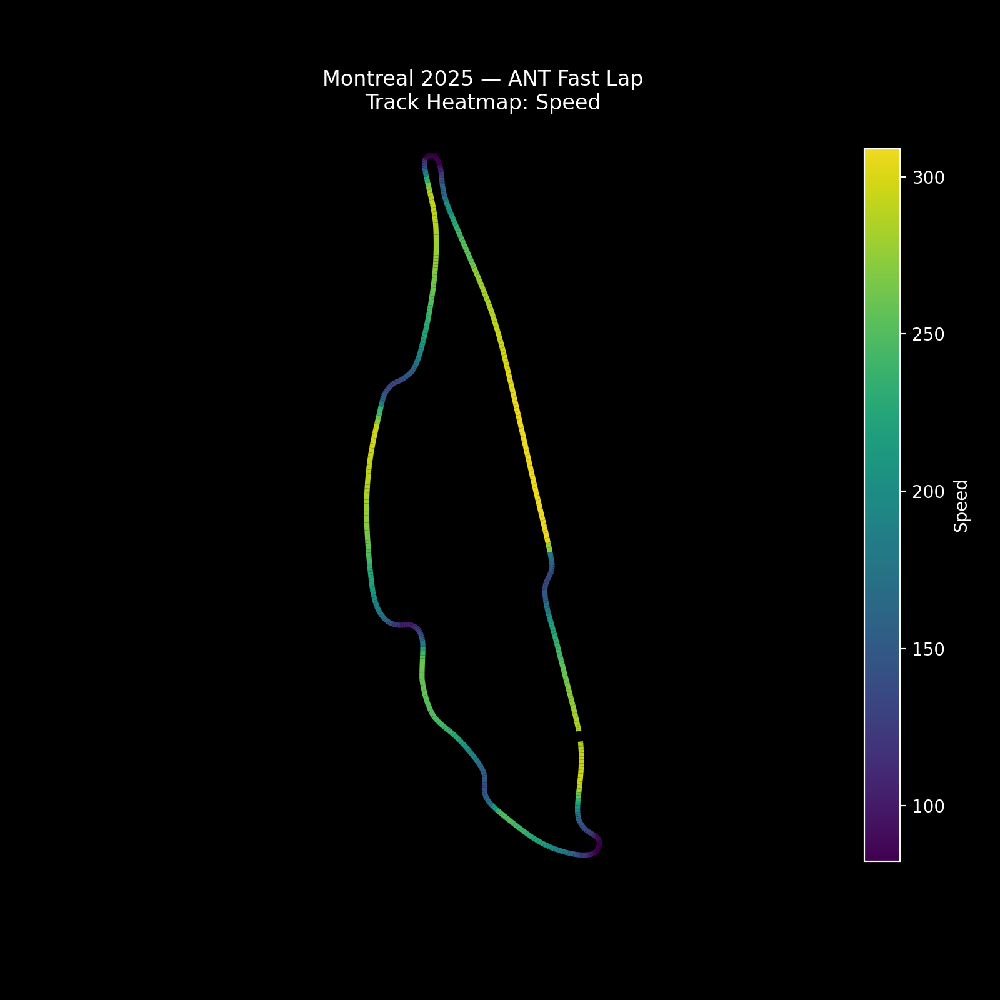
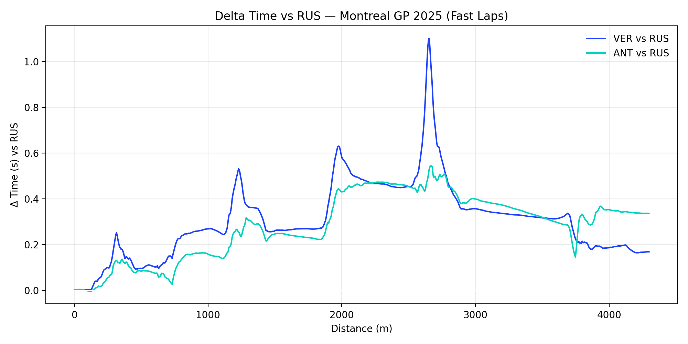

# Telemetry Strategy Analysis – Montreal GP 2025  
An in-depth review of the 2025 Montreal Grand Prix using official telemetry and lap timing data to uncover driver performance patterns, pit stop strategy decisions, and pace evolution.  

https://github.com/user-attachments/assets/76e4f83f-ab9f-4294-b30c-cd830646c8ae

---

## Race Results – Top 10  
1. **George Russell** – Mercedes – 1:31:52.688  
2. **Max Verstappen** – Red Bull – +0.228s  
3. **Andrea Kimi Antonelli** – Mercedes – +1.014s  
4. **Oscar Piastri** – McLaren – +2.109s  
5. **Charles Leclerc** – Ferrari – +3.442s  
6. **Lewis Hamilton** – Ferrari – +10.713s  
7. **Fernando Alonso** – Aston Martin – +10.972s  
8. **Nico Hülkenberg** – Kick Sauber – +15.364s  
9. **Esteban Ocon** – Haas – +1 Lap  
10. **Carlos Sainz Jr.** – Williams – +1 Lap  

---

## Technical Project Highlights  
- **Data Acquisition** – Collected telemetry & timing data via `FastF1`.  
- **Data Structuring** – Integrated lap times, stint data, and pit stops into cohesive datasets.  
- **Performance Analysis** – Evaluated pace trends, tyre degradation, and sector time differentials.  
- **Strategy Modelling** – Compared stint lengths, compound choices, and pit stop timings.  
- **Visualization** – Produced charts for lap evolution, pit windows, tyre degradation, and position changes.  

---

## Key Visuals  

### Lap Evolution (Rolling Median Pace)  
  

### Stint Timeline  
  

### Tyre Degradation Curves  
  

### Pit Stop Loss – Green vs SC/VSC  
  

### Undercut Gains (Top 20)  
  

### Track Heatmap – Speed (Antonelli Example)  
  

### Delta Time Plot – Russell vs Verstappen vs Antonelli  
  
